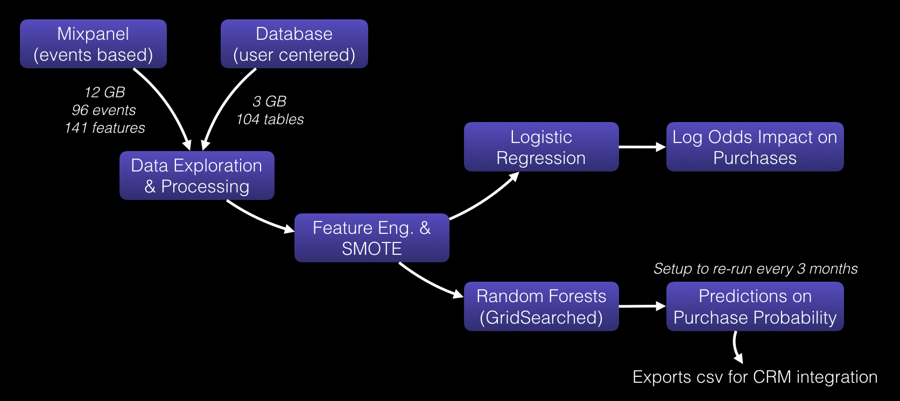
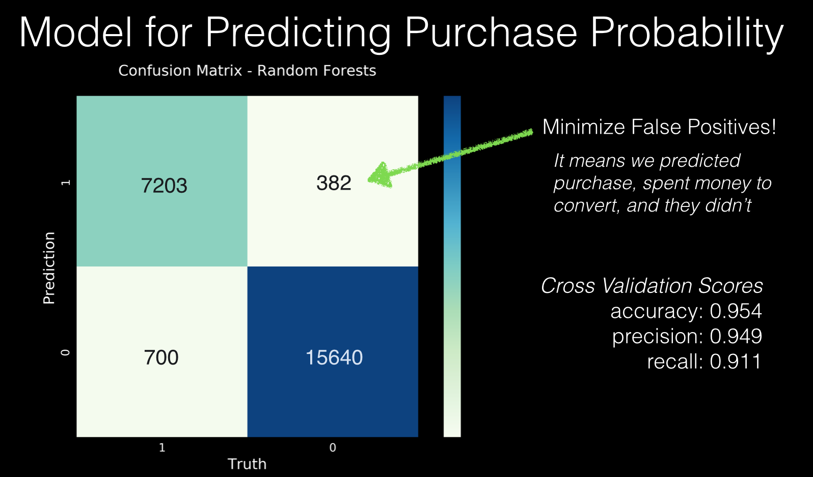
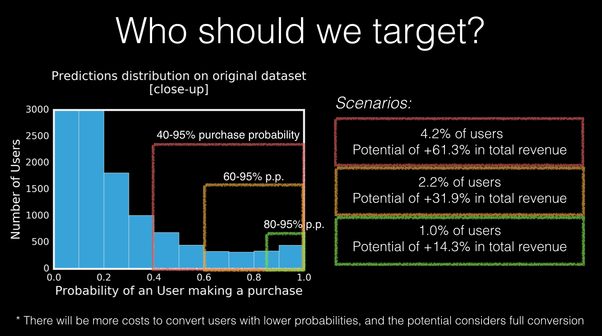

# Predicting art purchase and user targeting for a startup
#### Capstone project for Galvanize

[See the slides here!](https://github.com/pauloarantes/art-project/blob/master/Presentation/B9-PauloArantes%20v3.pdf)

Vango is an art marketplace where you can get original art from independent artists.

I scoped some challenges to focus on with their leadership team:

- What’s the best timing to engage users?
- Can we predict such an abstract purchase?
- What are purchase habits like?
- How much money can we make?

#### Pipeline process:

1. Aggregate event based data from Mixpanel (12GB, 96 events tracking 141 different features) with user based data from Postgres Database (3GB, 104 tables).
2. Data Exploration and Processing
3. Feature Engineering trying different engagement metrics
4. Apply SMOTE to treat imbalance class issue
5. Logistic Regression to extract log odds impact on purchase
6. GridSearch Random Forest models to Predict probabilities of purchase per user
7. Setup automatic script to run every 3 months (time based on EDA discoveries of purchase cycles)

#### Findings:

- What’s the best timing? Now.
- Can we predict such an abstract purchase? Yes.
- What are purchase habits like? Takes 103 days for first purchase,
repeats every 108 days, and 90% of users only make one purchase
- How much do they spend? About $250
- How much money can we make? Conservatively, +14.3% revenue

-> With the script, it is now possible for them to target users with best chances of making a purchase, and re-run the predictions at any time without retraining the entire model.

#### How to execute:
1) Run mixpanel_export.py script to get jsons from Mixpanel events (specify desired dates)

2) Restore the database dump with the following command:
    `CREATE DATABASE test_data;
    psql -d test_data -f /Users/pauloarantes/Drive/galvanize/_capstone/art-project/prod_dump;`

  If it doesn't work, try:
    `pg_restore --create --clean --if-exists -Fd -j8 --no-owner -Upauloarantes -d test_data /Users/pauloarantes/Drive/galvanize/_capstone/art-project/prod_dump;`

3) Run load_json_postgres to process and load Mixpanel data into the database as JSONB objects

4) Run prep-queries.py to generate assistant tables on the database to improve querying process time and memory

5) Run queries.py to query from db and export 2 csvs (purchases.csv and dataset.csv)

6) Run purchase_cycle_query.py to query from db and export 1 csv (purchase_cycle.csv)

7) I ran once the models.py to train the best Random Forest Classifier

8) You should run predict.py every three months or so to predict on new users. The results will be in the "purchase_probs.csv" file with user id, purchase probability and if they already bought or not in reality.
